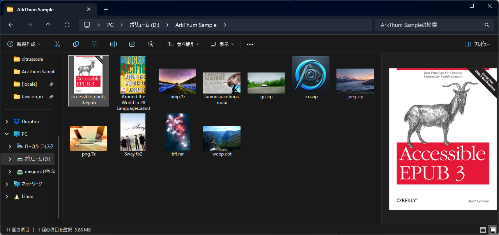
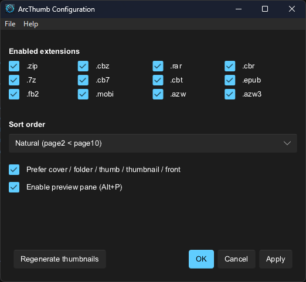

# ArcThumb


[](#license)
[](https://github.com/citrussoda-com/ArcThumb/releases)
[](#)
[](https://github.com/sponsors/citrussoda-com)

A Windows Explorer shell extension that shows cover thumbnails and preview-pane previews for comic book archives (ZIP, CBZ, RAR, CBR, 7Z, CB7, CBT) and ebooks (EPUB, FB2, MOBI, AZW, AZW3).

ArcThumb is inspired by [CBXShell](https://github.com/T800G/CBXShell) and [DarkThumbs](https://github.com/fire-eggs/DarkThumbs), rewritten in Rust with WebP support and Windows 10/11 as the baseline.



## What it does

- Shows the first image (or the cover, if one is identifiable) from an archive as the file's thumbnail in Explorer.
- For ebooks, parses the format-specific metadata so the right cover is picked instead of an arbitrary embedded image. EPUB uses the OPF manifest, FB2 uses the `<coverpage>` reference, and MOBI/AZW/AZW3 use the EXTH 201 CoverOffset record.
- Implements `IPreviewHandler` so the same cover shows up in Explorer's preview pane (`Alt+P`), rescaled when the splitter moves.
- Provides a small configuration GUI (`arcthumb-config.exe`) for toggling extensions, sort order, cover-name preference, the preview pane, and the UI language.
- Installs per-user under `%LOCALAPPDATA%\Programs\ArcThumb` by default with no admin rights. Run the installer elevated to install machine-wide under `%ProgramFiles%\ArcThumb` instead — required when Explorer runs at high integrity, such as Windows Sandbox.
- Wraps every COM entry point in `catch_unwind`, so a panic in the decoder cannot crash Explorer or `prevhost.exe`.

## Supported formats

### Containers

| Extension | Type | Notes |
|---|---|---|
| `.zip`, `.cbz` | ZIP / Comic Book ZIP | |
| `.rar`, `.cbr` | RAR / Comic Book RAR | |
| `.7z`, `.cb7`  | 7-Zip / Comic Book 7z | |
| `.cbt`         | Comic Book TAR | uncompressed tar |
| `.epub`        | EPUB 2 / EPUB 3 | OPF manifest |
| `.fb2`         | FictionBook 2 | inline base64 binaries |
| `.mobi`, `.azw`, `.azw3` | Amazon Kindle | EXTH 201 CoverOffset |

### Image formats inside archives

JPEG, PNG, GIF, BMP, TIFF, ICO, and WebP. Each format can be individually enabled or disabled in the configuration GUI. AVIF, HEIC, and SVG are not supported yet, mostly because their reference decoders pull in heavy C dependencies.

## Installing

Download `ArcThumb-Setup.exe` from [Releases](https://github.com/citrussoda-com/ArcThumb/releases) and run it. By default the installer is per-user, so Windows will not prompt for admin rights. Right-click the installer and choose **Run as administrator** (or accept the UAC dialog) to install machine-wide instead — required when Explorer runs at high integrity, such as Windows Sandbox or some enterprise lockdowns. New files get thumbnails immediately. The preview pane is enabled by default; press `Alt+P` in Explorer to open it.

To uninstall, use **Settings → Apps → Installed apps**, find `ArcThumb`, and remove it. Both files and registry entries are cleaned up.

## Configuration

Open **ArcThumb Configuration** from the Start menu.



- **Enabled extensions** turns the thumbnail provider on or off per file extension.
- **Image formats used for thumbnails** chooses which image formats (JPEG, PNG, GIF, BMP, TIFF, WebP, ICO) are eligible when picking a thumbnail from inside an archive. Disabling a format causes ArcThumb to skip files with that extension. This setting does not affect ebooks (EPUB, FB2, MOBI), which use their own metadata to locate the cover.
- **Sort order** decides which image counts as "the first one" inside an archive. Natural sort treats `page2.jpg` as smaller than `page10.jpg`. Alphabetical does the opposite. Natural is the default and is usually what you want for comics.
- **Prefer cover / folder / thumb / front** makes ArcThumb look for files named `cover.*`, `folder.*`, `thumb.*`, `thumbnail.*`, or `front.*` before falling back to sort order.
- **Enable preview pane** is a single switch that registers or unregisters the `IPreviewHandler` for every supported extension at once.
- **Language** is English or Japanese. The first run picks one based on `GetUserDefaultLocaleName`; afterwards it lives in `HKCU\Software\ArcThumb\Language`.

Apply takes effect immediately. There is no service to restart.

## Building from source

You need a stable Rust toolchain (2024 edition) and the *Desktop development with C++* workload from Visual Studio Build Tools. To build the installer you also need [Inno Setup 6](https://jrsoftware.org/isinfo.php).

```sh
git clone https://github.com/citrussoda-com/ArcThumb.git
cd ArcThumb

cargo build --release                          # DLL + config GUI

target\release\arcthumb-config.exe --install   # register (HKLM if elevated, otherwise HKCU)
target\release\arcthumb-config.exe --uninstall # undo (cleans both hives best-effort)

iscc installer\arcthumb.iss                    # build the installer
# output: target\installer\ArcThumb-Setup.exe
```

### Reinstalling after a DLL change

`arcthumb.dll` runs inside `explorer.exe`, the `dllhost.exe` COM
Surrogate, and (when the preview pane is open) `prevhost.exe`. While
any of those have it loaded, Windows refuses to overwrite the file
and the installer falls back to "queue for next reboot". The COM
Surrogate is the easiest one to forget — it can stay resident for
several minutes after the last thumbnail request.

The reliable way to refresh both binaries during local development:

```powershell
# 1. Build the new DLL + config GUI, then re-bundle the installer.
#    Skip step (b) and you'll be running an installer that contains
#    the previous build's exe.
cargo build --release                                        # (a)
iscc installer\arcthumb.iss                                  # (b)

# 2. Release every host process that holds the old DLL.
Stop-Process -Name explorer -Force -ErrorAction SilentlyContinue
Stop-Process -Name dllhost  -Force -ErrorAction SilentlyContinue
Stop-Process -Name prevhost -Force -ErrorAction SilentlyContinue

# 3. Run the freshly built installer. Same AppId, so it upgrades
#    the existing install in place. Tick "Launch ArcThumb
#    Configuration" on the Finish page.
.\target\installer\ArcThumb-Setup.exe

# 4. Bring Explorer back if the installer didn't already.
Start-Process explorer
```

If steps 1-4 still leave you with the old GUI or "file in use" errors,
the install state is wedged. To recover:

```powershell
# Kill the host processes again, then nuke the install dir by hand.
Stop-Process -Name explorer -Force -ErrorAction SilentlyContinue
Stop-Process -Name dllhost  -Force -ErrorAction SilentlyContinue
Stop-Process -Name prevhost -Force -ErrorAction SilentlyContinue
Remove-Item -Path "$env:LOCALAPPDATA\Programs\ArcThumb" -Recurse -Force -ErrorAction SilentlyContinue

# Belt-and-braces registry cleanup (the uninstaller normally handles
# this, but if it errored mid-run there can be leftovers).
Remove-Item -Path "HKCU:\Software\Classes\CLSID\{0F4F5659-D383-4945-A534-01E1EED1D23F}" -Recurse -Force -ErrorAction SilentlyContinue
Remove-Item -Path "HKCU:\Software\Classes\CLSID\{8C7C1E5F-3D4A-4E2B-9F1A-7B5D6E8F9A0C}" -Recurse -Force -ErrorAction SilentlyContinue

Start-Process explorer
.\target\installer\ArcThumb-Setup.exe
```

If even that fails, **sign out and back in** — that guarantees every
per-user `dllhost.exe` (and any other stragglers) is torn down.

### Tests

```sh
cargo test
cargo llvm-cov --summary-only
```

### Testing the update / donation dialogs

The config GUI checks for updates on startup and shows a donation prompt after a version upgrade. The environment variable `ARCTHUMB_FAKE_VERSION` overrides the compiled-in version at runtime, so you can test both dialogs without rebuilding.

```powershell
# --- Update notification dialog ---
# Pretend the running build is v0.0.1 so the latest GitHub release
# (v0.2.0) looks like a new version.
$env:ARCTHUMB_FAKE_VERSION = "0.0.1"
Remove-ItemProperty -Path 'HKCU:\Software\ArcThumb' -Name 'LastUpdateCheck' -ErrorAction SilentlyContinue
Remove-ItemProperty -Path 'HKCU:\Software\ArcThumb' -Name 'SkippedVersion' -ErrorAction SilentlyContinue
target\release\arcthumb-config.exe

# --- Donation prompt dialog ---
# Set LastSeenVersion older than the current build so the app thinks
# the user just upgraded.
Remove-Item Env:\ARCTHUMB_FAKE_VERSION -ErrorAction SilentlyContinue
Set-ItemProperty -Path 'HKCU:\Software\ArcThumb' -Name 'LastSeenVersion' -Value '0.1.0' -Type String
Set-ItemProperty -Path 'HKCU:\Software\ArcThumb' -Name 'DonationDismissed' -Value 0 -Type DWord
Set-ItemProperty -Path 'HKCU:\Software\ArcThumb' -Name 'DonationSkipCount' -Value 0 -Type DWord
target\release\arcthumb-config.exe
```

To disable the update check entirely:

```powershell
Set-ItemProperty -Path 'HKCU:\Software\ArcThumb' -Name 'UpdateCheckEnabled' -Value 0 -Type DWord
```

### Regenerating the icon

If you change `assets/icon.png`, run `cargo run --example make_icon` to rebuild the multi-resolution `assets/icon.ico` that gets embedded into the DLL and the config exe.

## Troubleshooting

### Thumbnails don't update after installing

Windows caches thumbnails in `thumbcache_*.db`, including the "this file has no thumbnail" answer. If you opened a comic file before installing ArcThumb, the cached negative result will keep showing instead of the new thumbnail. The easiest fix is the **Regenerate thumbnails** button in the configuration GUI (Start menu → ArcThumb Configuration). It does the equivalent of:

```powershell
Stop-Process -Name explorer -Force
Stop-Process -Name dllhost  -Force -ErrorAction SilentlyContinue
Remove-Item "$env:LOCALAPPDATA\Microsoft\Windows\Explorer\thumbcache_*.db" -Force -ErrorAction SilentlyContinue
Remove-Item "$env:LOCALAPPDATA\Microsoft\Windows\Explorer\iconcache_*.db" -Force -ErrorAction SilentlyContinue
Start-Process explorer
```

You only need to do this once after the first install. New files are not affected.

### The preview pane is empty

Check that **Enable preview pane** is on in the config GUI, and that Explorer's preview pane is actually visible (`Alt+P` or **View → Preview pane**). If both are on and the pane is still empty, kill `prevhost.exe` from Task Manager and reselect the file. The surrogate process sometimes holds onto a stale handler.

### Debug logging

Set `ARCTHUMB_LOG=1` in your user environment and ArcThumb writes a trace to `%TEMP%\arcthumb.log`:

```powershell
[System.Environment]::SetEnvironmentVariable("ARCTHUMB_LOG", "1", "User")
# Restart Explorer, then:
Get-Content "$env:TEMP\arcthumb.log"
```

## How it's put together

ArcThumb ships two COM classes inside one DLL:

| Class | CLSID | Purpose |
|---|---|---|
| `ArcThumbProvider` | `{0F4F5659-...}` | `IThumbnailProvider`, hosted in Explorer |
| `ArcThumbPreviewHandler` | `{8C7C1E5F-...}` | `IPreviewHandler`, hosted in `prevhost.exe` |

By default both register under `HKCU`, so installing and removing ArcThumb never touches the machine-wide registry. Running the installer elevated registers under `HKLM` instead, which is required when Explorer runs at high integrity (Windows Sandbox, some enterprise lockdowns) because that Explorer ignores HKCU CLSIDs by Microsoft's COM-hijacking defence. Uninstall best-effort cleans both hives.

The Inno Setup installer does not write any CLSID keys directly. It runs `arcthumb-config.exe --install` after copying the files, and `--uninstall` before removing them. This keeps the installer ignorant of the COM details and lets developers re-register a fresh build with one CLI command.

## Known limitations

- AVIF, HEIC, SVG, and DjVu are not supported.
- Animated GIF and animated WebP show only the first frame.
- Encrypted archives are not supported.
- Very large archives are skipped by safety limits, including a 256 MB cap on decoded image size.
- The preview pane shows the cover image only. There is no multi-image gallery view.

## License

Dual-licensed under your choice of [MIT](LICENSE-MIT) or [Apache 2.0](LICENSE-APACHE).

Third-party components redistributed with `arcthumb-config.exe` are listed in [THIRD_PARTY_LICENSES.md](THIRD_PARTY_LICENSES.md). In particular, the configuration GUI uses [Slint](https://slint.dev/) under the Slint Royalty-Free License 2.0; attribution is shown via the **About** button inside the settings window.

## Credits

The idea comes from [CBXShell](https://github.com/T800G/CBXShell) by T800 Productions and [DarkThumbs](https://github.com/fire-eggs/DarkThumbs) (originally by kaioa, now maintained by fire-eggs). The implementation uses [windows-rs](https://github.com/microsoft/windows-rs) for COM, [image](https://github.com/image-rs/image) for decoding, [zip](https://github.com/zip-rs/zip2) / [unrar](https://github.com/muja/unrar.rs) / [sevenz-rust](https://crates.io/crates/sevenz-rust) / [tar](https://github.com/alexcrichton/tar-rs) for archives, and [Slint](https://slint.dev/) for the configuration dialog.

Bug reports and feature requests go to [GitHub Issues](https://github.com/citrussoda-com/ArcThumb/issues).
